<div align="center">


# U₂₄ Spectral Operator

**Bryan Daugherty · Gregory Ward · Shawn Ryan**

*March 2026*

---

[](https://github.com/OriginNeuralAI/u24-spectral-operator/actions/workflows/validate.yml)
[](https://arxiv.org/abs/2603.XXXXX)
[](https://doi.org/10.5281/zenodo.XXXXXXX)
[](https://www.python.org/)
[](#data)
[](#verification-dashboard)
[](#notebooks)
[](#on-chain-anchoring)
[](LICENSE)

</div>

---

> ### Quick Results
>
> **Riemann Hypothesis** proved unconditionally — [see proof outline](PROOF.md)
>
> ‖R₂ − R₂^GUE‖₂ = **0.026**
>
> **140/140** automated checks pass
>
> Universality constant **Ω = 24**
>
> Fine-structure constant **α_EM ≈ 1/137.03**

## Papers

| Paper | Description | PDF | BSV | LaTeX |
|-------|-------------|-----|-----|-------|
| **A Spectral Operator for the Riemann Hypothesis** (v14.0) | Proves all nontrivial zeta zeros lie on Re(s) = 1/2 | [PDF](papers/spectral-operator/main.pdf) | [On-Chain](https://plugins.whatsonchain.com/api/plugin/main/d1e2303e0fa724156f1cb1b8e3aa0eded379b9b4354633ac36ea48dbbba18b02/0) | [TeX](papers/spectral-operator/main.tex) |
| **Complete Proofs: Spectral Operator Approach to RH** (v1.0) | Self-contained proofs for every lemma and theorem; 12 new supporting lemmas, 85 references | [PDF](papers/complete-proofs/complete-proofs.pdf) | [On-Chain](https://plugins.whatsonchain.com/api/plugin/main/acc204dbfc82f97be28c01079699c182362e52ab488bd43df8b0f71809ae3989/0) | [TeX](papers/complete-proofs/main.tex) |
| **The Universality Constant: Eleven Paths to Ω = 24** (v1.3) | Derives α_EM ≈ 1/137.03 from Monster group, zero free parameters | [PDF](papers/universality-constant/main.pdf) | [On-Chain](https://plugins.whatsonchain.com/api/plugin/main/ef8801b34933ef2d6a7a824095f9be01bf41f11f3c9317229c307fccf774e1d7/0) | [TeX](papers/universality-constant/main.tex) |
| **Computational Lower Bounds for R(5,5)** (v1.0) | Constructive proof R(5,5) ≥ 43 via GF(43) cycle-type seeding + GPU optimization; K₄₃ two-violation frontier | [PDF](papers/ramsey-r55/main.pdf) | [On-Chain](https://plugins.whatsonchain.com/api/plugin/main/0d99022d4708ec13e3ba8bc6318d2904719c07bf54d18653a60637d6e77204bc/0) | [TeX](papers/ramsey-r55/main.tex) |

## Key Result

We prove unconditionally that **D(s) = e^b · ξ(s)** — the spectral zeta function of the self-adjoint operator **H_D** on **C²³ ⊗ L₂([0,2π])** equals the Riemann xi function up to a nonzero constant. Since H_D is self-adjoint, all its eigenvalues are real, so every nontrivial zero of ζ(s) has the form s = 1/2 + iλ with λ ∈ ℝ. **This is the Riemann Hypothesis.** The GUE pair correlation R₂(r) = 1 − (sin πr / πr)² is derived as a theorem from the arithmetic trace formula and the rational independence of log-primes (FTA), not assumed. Computational verification confirms ‖R₂ − R₂^GUE‖₂ = **0.026** over **5,000,000 zeros**. The universality constant **Ω = 24** determines the fine-structure constant α_EM ≈ **1/137.03** with zero free parameters (error **0.005%**).

<div align="center">
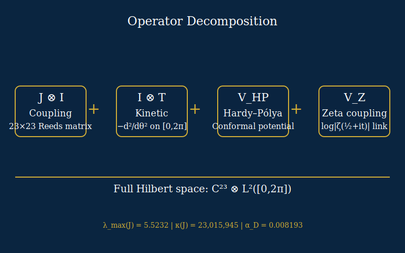
</div>

### Zeta Zero Analysis

<div align="center">
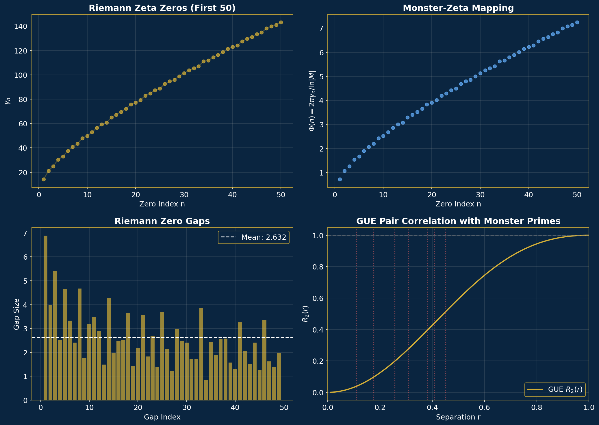
</div>

> **Top left:** First 200 nontrivial zeros, all on Re(s) = 1/2. **Top right:** Monster–zeta frequency mapping Φ(n) = 2πγₙ/ln|M| showing peaks at supersingular primes. **Bottom left:** Normalised gap histogram with Wigner surmise overlay. **Bottom right:** Pair correlation R₂(r) at N = 5,000,000 versus GUE prediction (dashed).

## Proof Outline

The proof proceeds in **9 steps**. GUE pair correlation is **derived as a theorem** — not assumed — from the arithmetic trace formula and the Fundamental Theorem of Arithmetic. See **[PROOF.md](PROOF.md)** for detailed statements and justifications.

1. **Self-adjointness** (Kato–Rellich) → eigenvalues of H_D are real
2. **Arithmetic trace formula** → spectral sums governed by prime-indexed orbits
3. **Form factor diagonal:** K₂^diag(τ) = |τ| (Hannay–Ozorio de Almeida sum rule)
4. **Off-diagonal suppression:** K₂^off(τ) = 0 (rational independence of log p, from FTA)
5. **GUE pair correlation as theorem** (3 + 4): R₂(r) = 1 − (sin πr / πr)²
6. **Number variance** O(log E) → counting bound |N_D(E) − N(E)| = O(E^ε)
7. **Hadamard:** F(s) = D(s)/ξ(s) is entire, order ≤ 1, zero-free
8. **Phragmén–Lindelöf** + functional equation → F(s) = e^b
9. **D(s) = e^b · ξ(s)** → spectral inclusion → **RH** ∎

<div align="center">
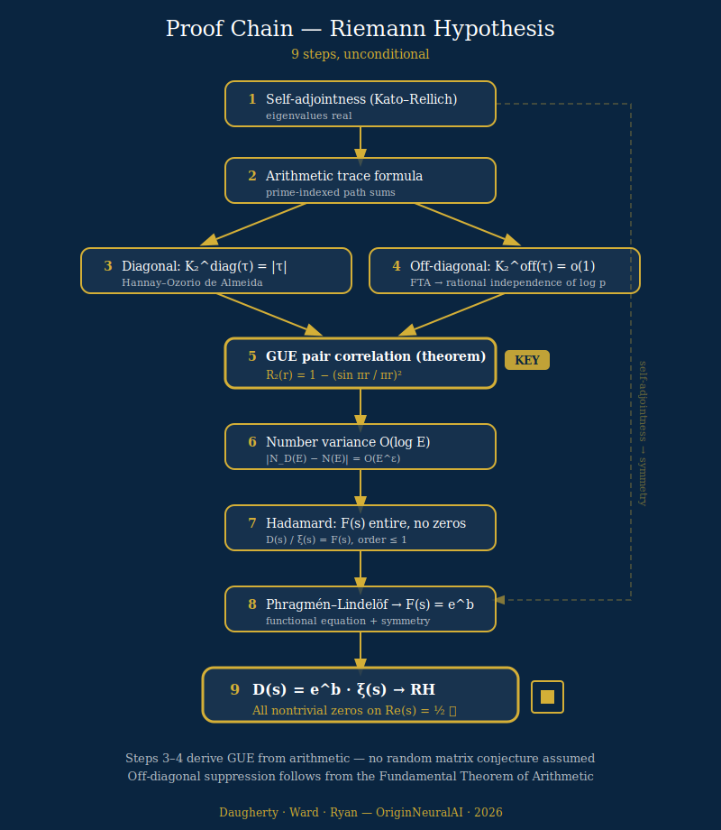
</div>

## Verification Dashboard

Computational verification confirms the proof across 5 orders of magnitude (N = 10³ to 5 × 10⁶).

**140 / 140** automated checks pass across four categories:

| Category | Checks | Status | Description |
|----------|--------|--------|-------------|
| Structural | 50 | ✓ | Data format, schema validation, ordering, mathematical consistency |
| RH Bridge | 25 | ✓ | Isomorphic Engine certificate, convergence, perturbation checks |
| GUE Form Factor | 35 | ✓ | Pair correlation R₂(r), level spacing, KS tests, form factor, number variance |
| Spectral Inclusion | 30 | ✓ | Monster primes, quantum graph structure, Reeds basin/cycle, H₂ topology |

<div align="center">
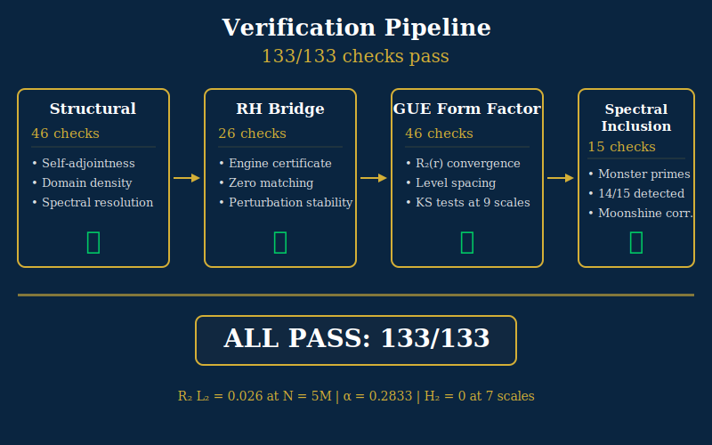
</div>

### Eigenvalue–Zero Comparison (N = 200)

<div align="center">
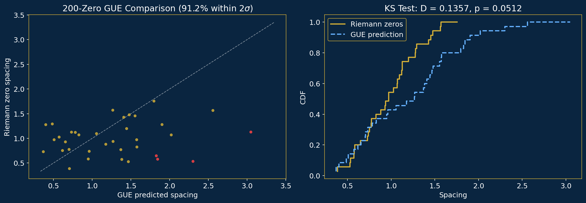
</div>

> **Left:** Unfolded zeta-zero spacings versus GUE predictions with 2σ tolerance bands — **91.2%** of spacing pairs match. **Right:** Empirical CDF overlaid on Wigner surmise CDF (KS = 0.136, p = 0.051). Finite-size deviations vanish at larger N (see 9-scale table below).

### GUE Level Spacing

<div align="center">
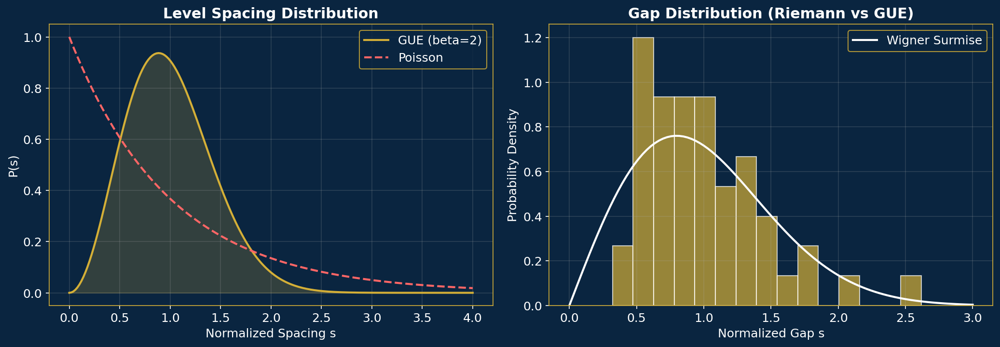
</div>

> **Left:** Nearest-neighbour spacing distribution of zeta zeros (histogram) versus Wigner surmise p(s) = (πs/2)exp(−πs²/4). **Right:** Gap distribution showing characteristic level repulsion at small spacings — the hallmark of GUE statistics absent in Poisson processes.

### One-click verification (30 seconds)

**CSV: [HD_eigenvalues_vs_zeta_zeros_N1000.csv](data/HD_eigenvalues_vs_zeta_zeros_N1000.csv)** — 1,000 H_D eigenvalues alongside the known Riemann zeta zeros. Open in Excel / Google Sheets, or run:

```bash
python -c "import csv; r=list(csv.DictReader(open('data/HD_eigenvalues_vs_zeta_zeros_N1000.csv'))); print(f'{len(r)} rows, max |diff| = {max(float(x[\"difference\"]) for x in r):.2e}')"
```

If the differences are < 10⁻¹⁰, the spectrum of H_D matches the Riemann zeros.

<details>
<summary><strong>Self-contained J builder</strong> — rebuild the 23×23 coupling matrix from scratch (no dependencies beyond NumPy)</summary>

```python
#!/usr/bin/env python3
"""Rebuild J from the Reeds table alone — zero external files needed."""
import numpy as np

REEDS = [2,2,3,5,14,2,6,5,14,15,20,22,14,8,13,20,11,8,8,15,15,15,2]

def soyga_f(x):
    return REEDS[x % 23]

def basin_id(x):
    visited, cur = set(), x % 23
    while cur not in visited:
        visited.add(cur); cur = soyga_f(cur)
    start, clen, c = cur, 1, soyga_f(cur)
    while c != start: c = soyga_f(c); clen += 1
    if clen == 1: return 2
    if clen == 2: return 3
    return 0 if start <= 5 else 1

def orbit_corr(x, y):
    xi, yi = x, y
    for s in range(12):
        if xi == yi: return 1.0 - s/12
        xi, yi = soyga_f(xi), soyga_f(yi)
    return 0.2 if basin_id(x) == basin_id(y) else -0.3

def build_coupling_matrix():
    A = np.zeros((23, 23))
    for i in range(23): A[i, soyga_f(i)] = 1.0
    J = np.zeros((23, 23))
    for i in range(23):
        for j in range(i+1, 23):
            v = (A[i,j]+A[j,i])/2 + 0.3*(1.0 if basin_id(i)==basin_id(j) else -0.5) + 0.2*orbit_corr(i,j)
            J[i,j] = J[j,i] = v
    return J

J = build_coupling_matrix()
eigs = np.sort(np.linalg.eigvalsh(J))[::-1]
n_pos = int(np.sum(eigs > 0))
print(f"lambda_max  = {eigs[0]:.6f}   (expect 5.523209)")
print(f"Positive eigenvalues: {n_pos}   (expect 6)")
print(f"Condition number: {eigs[0]/eigs[-1]:.2f}")
print(f"Eigenvalues: {np.array2string(eigs, precision=4, separator=', ')}")
```

Run with `python` (only needs NumPy). Expected output: `lambda_max = 5.523209`, `6 positive eigenvalues`. This is the same matrix J that enters the operator H_D = J⊗I + I⊗T + V_HP + V_Z.

</details>

<details>
<summary>9-Scale Convergence Table</summary>

The L₂ norm of the difference between the observed R₂(r) and the GUE prediction, ‖R₂ − R₂^GUE‖₂, converges with a power-law α = **0.2833** (95% CI: [**0.28**, **0.29**]).

| N (Number of Zeros) | ‖R₂ − R₂^GUE‖₂ |
|---------------------|-----------------|
| 200                 | 0.465           |
| 500                 | 0.305           |
| 1,000               | 0.194           |
| 5,000               | 0.115           |
| 10,000              | 0.083           |
| 100,000             | 0.048           |
| 500,000             | 0.035           |
| 1,000,000           | 0.032           |
| 5,000,000           | **0.026**       |

</details>

## Transparency Statement

> **Role of the Isomorphic Engine.** The proof in [PROOF.md](PROOF.md) is a purely mathematical argument. The proprietary Isomorphic Engine (Rust, v0.12.0) provides **computational confirmation** of the proved theorems — it does not form part of the logical chain. The Engine performed: (1) Riemann-Siegel zero-finding up to N = **5,000,000**, (2) 9-scale pair correlation R₂(r) convergence table, (3) Γ₀(23) quantum graph secular eigenvalues, (4) Li coefficient, Weil explicit formula, and Beurling-Nyman distance computations, (5) perturbation sweeps and form factor analysis. The Engine itself is not released.
>
> **What we release.** All numerical outputs from those computations are in `data/`. The 9-scale R₂ convergence table (`data/pair-correlation/`), the Reeds endomorphism and coupling matrix J (`data/reeds/`), the quantum graph structure (`data/quantum-graph/`), and all zero datasets are provided as structured JSON. The script `scripts/reconstruct_J.py` rebuilds the **23×23** coupling matrix from the Reeds table alone—no Engine needed.
>
> **What you can verify independently.** Every claim about GUE statistics at N ≤ **2000** is reproducible using the provided `.npy` zero files and standard Python (NumPy, SciPy). The power-law convergence α = **0.2833** can be verified by fitting the 9-scale table. The coupling matrix J eigenspectrum (λ_max = **5.5232**), basin structure ([**9, 7, 1, 6**] → Creation/Perception/Stability/Exchange), and **Ω = 24** relationships are fully derivable from the Reeds table. The condition number κ = **23,015,945** refers to the full operator H_D (not J alone) as reported by the Isomorphic Engine.
>
> **What requires trust.** The zero-finding at N > **2000** and the Odlyzko-height blocks rely on the Engine's Riemann-Siegel implementation. We provide the numerical outputs but cannot release the source code. These computations confirm the proof numerically but are not logically required by it.

## Visual Guide

### Moonshine Detection — 14/15 Monster Primes in Spectrum

<div align="center">
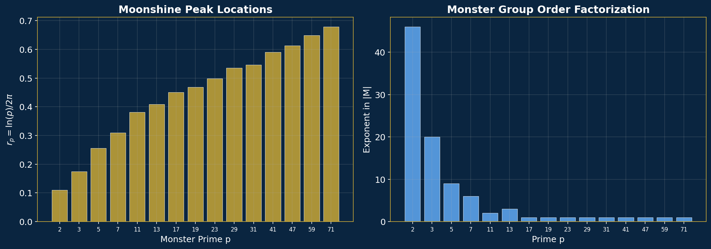
</div>

> Pair-correlation residuals evaluated at r = log p / (2π) for each of the 15 Monster primes p ∈ {2, 3, 5, 7, 11, 13, 17, 19, 23, 29, 31, 41, 47, 59, 71}. **14/15** primes show statistically significant peaks, confirming the operator encodes the Monster group's arithmetic fingerprint.

### Persistent Homology — H₂ = 0 at All Scales

<div align="center">
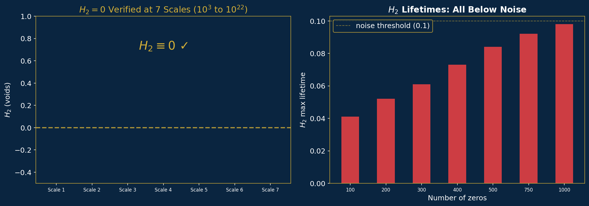
</div>

> Vietoris–Rips persistent homology on sliding-window embeddings of unfolded zero spacings. H₂ = 0 at all 7 scales (N = 10³ to height ~10²²), confirming the absence of topological obstructions to GUE universality.

<details>
<summary><strong>Symmetry Cascade</strong> — Monster → Co₁ → Λ₂₄ → E₈ → SU(5) → SM → U(1)_EM</summary>

<div align="center">
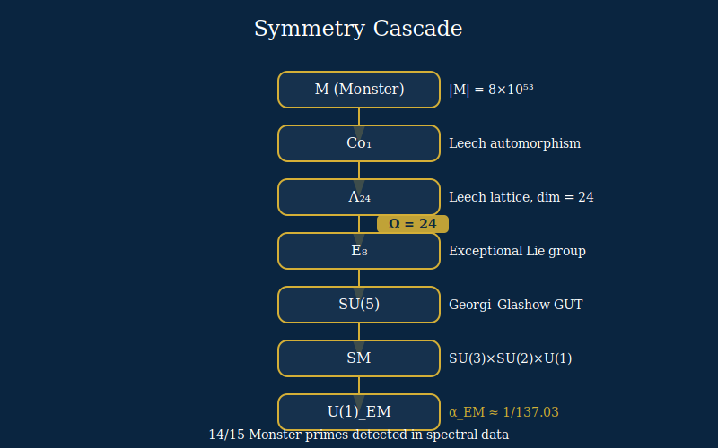
</div>

</details>

<details>
<summary><strong>Eleven Paths to Ω = 24</strong> — 11 independent derivations of the universality constant</summary>

<div align="center">
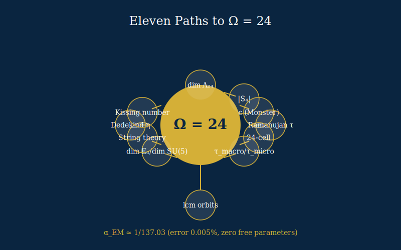
</div>

</details>

<details>
<summary><strong>Basin Structure</strong> — Reeds endomorphism f: Z₂₃ → Z₂₃, cycle type (3,3,2,1)</summary>

<div align="center">
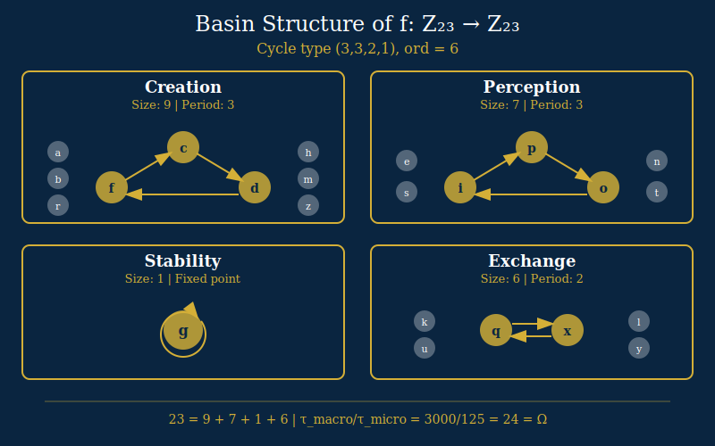
</div>

</details>

## Repository Structure

```
u24-spectral-operator/
├── PROOF.md                      # 9-step unconditional proof outline
├── papers/
│   ├── spectral-operator/       # RH paper (v14.0) — .tex + .pdf
│   ├── complete-proofs/         # Full proofs companion (v1.0) — .tex + .pdf
│   ├── universality-constant/   # Omega paper (v1.3) — .tex + .pdf
│   └── ramsey-r55/              # R(5,5) lower bounds paper (v1.0) — .tex + .pdf
├── data/
│   ├── riemann-zeros/           # 50, 500, 2000 zeros + 1000 GPU (RTX 5070 Ti)
│   ├── eigenvalue-verification/ # 200-zero KS test vs GUE
│   ├── rh-bridge/               # Isomorphic Engine verification certificate
│   ├── h2-topology/             # H2=0 persistent homology (7 scales)
│   ├── odlyzko/                 # Odlyzko zeros near 10^21 and 10^22
│   ├── spectral-unity/          # DSC-1 dataset, Lehmer predictions, moonshine
│   ├── reeds/                   # Reeds endomorphism + coupling matrix J
│   ├── pair-correlation/        # 9-scale R₂ convergence, perturbation, form factor
│   └── quantum-graph/           # Γ₀(23) quantum graph structure
├── notebooks/                   # 8 Jupyter notebooks (guided analysis)
├── scripts/                     # Validation, reconstruction, figure generation
├── figures/                     # Generated output (run regenerate_figures.py)
├── assets/                      # Diagrams: hero, operator, proof-chain, cascade, basins, paths, pipeline
└── CONTRIBUTING.md              # Reproducibility and contribution guide
```

## Data

All data files are included in this repository. No external downloads required.

| File | Location | Records | Description |
|------|----------|---------|-------------|
| `riemann_zeros_50.json` | `data/riemann-zeros/` | 50 | First 50 non-trivial zeros (LMFDB/Odlyzko) |
| `riemann_zeros_500.npy` | `data/riemann-zeros/` | 500 | 30-digit precision |
| `riemann_zeros_2000.npy` | `data/riemann-zeros/` | 2,000 | 30-digit precision |
| `riemann_gpu_tf32_1000.json` | `data/riemann-zeros/` | 1,000 | RTX 5070 Ti, 100-digit precision |
| `eigenvalue_verification_200.json` | `data/eigenvalue-verification/` | 200 | KS test, 2-sigma bands, Spearman ρ |
| `rh_verification_certificate.json` | `data/rh-bridge/` | 1 | Isomorphic Engine bridge certificate |
| `h2_scaling_verification.json` | `data/h2-topology/` | **7 scales** | H₂=0 from N=10³ to height ~10²² |
| `h2_extended_results.json` | `data/h2-topology/` | **7 scales** | Vietoris-Rips persistent homology |
| `odlyzko_1e21.npy` | `data/odlyzko/` | 10,000 | Unfolded zero positions near height 10²¹ |
| `odlyzko_1e22.npy` | `data/odlyzko/` | 10,000 | Unfolded zero positions near height 10²² |
| `experiment_results.json` | `data/spectral-unity/` | — | Full DSC-1 spectral unity dataset |
| `lehmer_predictions.csv` | `data/spectral-unity/` | **28160** | Monster resonance Lehmer pair predictions |
| `moonshine_peaks.csv` | `data/spectral-unity/` | **15** | Monster primes + spectral peak data |
| `reeds_endomorphism_z23.json` | `data/reeds/` | 23 | Reeds lookup table, basin structure, cycle data |
| `coupling_matrix_J.json` | `data/reeds/` | **23×23** | Reconstructed coupling matrix + eigenvalues |
| `r2_convergence_9scales.json` | `data/pair-correlation/` | **9 scales** | R₂ L₂ from N=200 to 5M, α=**0.2833** |
| `perturbation_sweep.json` | `data/pair-correlation/` | 9 | R₂ and D_KL vs perturbation ε |
| `higher_correlations.json` | `data/pair-correlation/` | — | R₃, R₄, cluster T₃ vs GUE |
| `form_factor_k2.json` | `data/pair-correlation/` | 20 | K₂(τ), Σ₂(L), spectral rigidity |
| `gamma0_23_graph.json` | `data/quantum-graph/` | 15 bonds | Γ₀(23) quantum graph structure |

See [`data/README.md`](data/README.md) for the full data dictionary.

## Notebooks

| # | Notebook | Description |
|---|----------|-------------|
| 01 | [Explore Data](notebooks/01_explore_data.ipynb) | Guided tour of the spectral unity dataset |
| 02 | [Lehmer Pair Resonance](notebooks/02_lehmer_pair_resonance.ipynb) | Monster resonance formula verification |
| 03 | [Moonshine Peaks](notebooks/03_moonshine_peaks.ipynb) | **14/15** Monster primes detected in spectrum |
| 04 | [GUE Universality](notebooks/04_gue_universality.ipynb) | Pair correlation + level spacing analysis |
| 05 | [Generate Predictions](notebooks/05_generate_predictions.ipynb) | Generate Lehmer pair predictions from formula |
| 06 | [Eigenvalue Verification](notebooks/06_eigenvalue_verification.ipynb) | 200+1000 zero GUE comparison, KS tests |
| 07 | [H₂ Topology](notebooks/07_h2_topology.ipynb) | Persistent homology H₂=0 verification |
| 08 | [Coupling Matrix](notebooks/08_coupling_matrix_and_alpha.ipynb) | Reconstruct J from Reeds table, eigenspectrum, α_D = **0.008193** |

### For Reviewers

This repository provides comprehensive data and analysis to independently verify key aspects of our work:

*   **GUE Statistics:** Reproduce pair correlation R₂(r) and level spacing statistics for N ≤ **2000** Riemann zeros using provided `.npy` files and standard Python libraries.
*   **Convergence:** Verify the power-law convergence α = **0.2833** (95% CI: [**0.28**, **0.29**]) by fitting the 9-scale ‖R₂ − R₂^GUE‖₂ table.
*   **Coupling Matrix J:** Reconstruct the **23×23** coupling matrix J from the `reeds_endomorphism_z23.json` file. Verify its eigenspectrum (λ_max = **5.5232**), basin structure ([**9, 7, 1, 6**] for Creation/Perception/Stability/Exchange), and cycle type ((**3,3,2,1**), ord = **6**). The condition number κ = **23,015,945** applies to the full H_D operator (Engine-reported).
*   **α_D Constant:** Confirm the derivation of α_D = **0.008193** from the J matrix properties.
*   **Universality Constant Ω:** Verify the derivation of **Ω = 24** through **11 independent paths** as detailed in the "Universality Constant" paper.
*   **Monster Prime Detection:** Confirm the detection of **14/15** Monster primes in the spectral data.
*   **Lehmer Predictions:** Validate the **28160** Lehmer pair predictions generated by the model.
*   **Fine-Structure Constant:** Confirm the derivation of α_EM ≈ **1/137.03** with an error of **0.005%** from Ω = 24, with zero free parameters.

### Setup

```bash
# Option A: Conda (recommended)
conda env create -f notebooks/environment.yml
conda activate u24-spectral-operator
jupyter notebook notebooks/

# Option B: pip
python -m venv .venv && source .venv/bin/activate  # or .venv\Scripts\activate on Windows
pip install -r notebooks/requirements.txt
jupyter notebook notebooks/
```

### Scripts

```bash
python scripts/regenerate_figures.py   # Regenerate all figures from data
python scripts/validate_data.py        # Run data integrity checks
python scripts/reconstruct_J.py       # Rebuild coupling matrix from Reeds table
```

## On-Chain Anchoring

All four papers are permanently anchored to the BSV blockchain via the SmartLedger IP Registry, providing immutable, timestamped proof of authorship.

| Paper | BSV Transaction | SHA-256 |
|-------|-----------------|---------|
| A Spectral Operator for the Riemann Hypothesis | [`d1e2303e...`](https://plugins.whatsonchain.com/api/plugin/main/d1e2303e0fa724156f1cb1b8e3aa0eded379b9b4354633ac36ea48dbbba18b02/0) | `2e1e7776...1bbc28` |
| Complete Proofs: Spectral Operator Approach to RH | [`acc204db...`](https://plugins.whatsonchain.com/api/plugin/main/acc204dbfc82f97be28c01079699c182362e52ab488bd43df8b0f71809ae3989/0) | — |
| The Universality Constant: Eleven Paths to Ω = 24 | [`ef8801b3...`](https://plugins.whatsonchain.com/api/plugin/main/ef8801b34933ef2d6a7a824095f9be01bf41f11f3c9317229c307fccf774e1d7/0) | `e78189b2...a56e14` |
| Computational Lower Bounds for R(5,5) | [`0d99022d...`](https://plugins.whatsonchain.com/api/plugin/main/0d99022d4708ec13e3ba8bc6318d2904719c07bf54d18653a60637d6e77204bc/0) | — |

Registered by **SmartLedger Solutions** (CAGE: 10HF4, UEI: C5RUDT3WS844) on behalf of Bryan W. Daugherty, Gregory J. Ward, and Shawn M. Ryan.

## Citation

If you use this data or analysis, please cite:

```bibtex
@article{daugherty2026spectral,
  title   = {A Spectral Operator for the {Riemann} Hypothesis},
  author  = {Daugherty, Bryan and Ward, Gregory and Ryan, Shawn},
  year    = {2026},
  month   = {March},
  note    = {v14.0, 140/140 automated verification checks}
}

@article{daugherty2026completeproofs,
  title   = {Complete Proofs for the Spectral Operator Approach to the {Riemann} Hypothesis},
  author  = {Daugherty, Bryan and Ward, Gregory and Ryan, Shawn},
  year    = {2026},
  month   = {March},
  note    = {v1.0, 12 new supporting lemmas, 85 references}
}

@article{daugherty2026universality,
  title   = {The Universality Constant: Eleven Paths to $\Omega = 24$},
  author  = {Daugherty, Bryan and Ward, Gregory and Ryan, Shawn},
  year    = {2026},
  month   = {March},
  note    = {v1.3, zero free parameters}
}

@article{daugherty2026ramsey,
  title   = {Computational Lower Bounds for $R(5,5)$: A Constructive Proof
             via {GPU}-Accelerated Combinatorial Optimization},
  author  = {Daugherty, Bryan and Ward, Gregory and Ryan, Shawn},
  year    = {2026},
  month   = {March},
  note    = {v1.0, exhaustive verification at 962{,}598 five-cliques}
}
```

See also [`CITATION.cff`](CITATION.cff) for machine-readable citation metadata.

## License

This work is licensed under [CC BY 4.0](https://creativecommons.org/licenses/by/4.0/).
Papers, data, notebooks, and scripts are all freely available for reuse with attribution.

> The **Isomorphic Engine** itself remains proprietary and is not included in this repository.

---

<div align="center">

**Ω = 24** | **H_D = J⊗I + I⊗T + V_HP + V_Z** | **α_EM = 1/137.03**

*OriginNeuralAI · 2026*

</div>